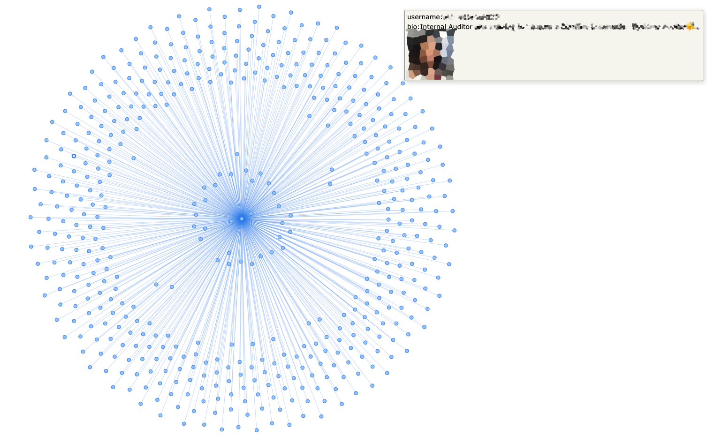
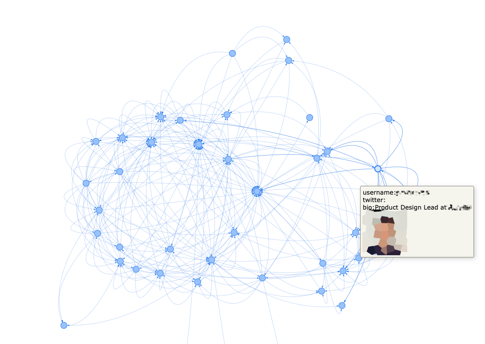

# Clubhouse dummy parser and graph generator (CDPaGG)

This script is an experimental PoC that allows you to collect data about CLubhouse user profiles and generate graphs based on the received data.

Details about how we used that PoC during RedTeam project you will find in our blogpost: [The short story about clubhouse user scraping and social graphs](https://hexway.io/research/short-story-about-clubhouse-user-scraping-and-social-graphs/)  

## Disclaimer

***This project is created only for educational purposes and cannot be used for law violation or personal gain.<br/>The author of this project is not responsible for any possible harm caused by the materials of this project***

## Installation

```
# clone main repo
git clone https://github.com/hexway/Clubhouse-dummy-parser-and-graph-generator.git && cd ./Clubhouse-dummy-parser-and-graph-generator
# install dependencies
sudo pip3 install -r requirements.txt
# authenticate in clubhouse
python3 clubhouse-graphs.py
[.] Please enter your phone number. (+818043217654) > +12344566777
[.] Please enter the SMS verification code (1234, 0000, ...) > 1234
[.] Writing configuration file complete
```

## How to use

## Get user profile by username

```
 ~: python3 clubhouse-graphs.py -u chipik --followers --following
|------------|-----------|-------------|--------------------------------------------------------------------------------------------|----------|------------------------|---------|-----------|-----------|-----------|------------|-----------------|
|  user_id   |    name   | displayname |                                         photo_url                                          | username |          bio           | twitter | instagram | followers | following | invited by | invited by name |
|------------|-----------|-------------|--------------------------------------------------------------------------------------------|----------|------------------------|---------|-----------|-----------|-----------|------------|-----------------|
| 1964245387 | Dmitry Ch |             | https://clubhouseprod.s3.amazonaws.com:443/1964245387_428c3161-1d0e-456e-b2a7-66f82b143094 | chipik   | - hacker               | _chipik |           |       110 |        96 |  854045411 | Al Fova         |
|            |           |             |                                                                                            |          | - researcher           |         |           |           |           |            |                 |
|            |           |             |                                                                                            |          | - speaker              |         |           |           |           |            |                 |
|            |           |             |                                                                                            |          |                        |         |           |           |           |            |                 |
|            |           |             |                                                                                            |          | Do things at hexway.io |         |           |           |           |            |                 |
|            |           |             |                                                                                            |          | tg: @chpkk             |         |           |           |           |            |                 |
|------------|-----------|-------------|--------------------------------------------------------------------------------------------|----------|------------------------|---------|-----------|-----------|-----------|------------|-----------------|
```

## Get user profiles by group id

```
~: python3 clubhouse-graphs.py --group 444701692
[INFO ] Getting info about group Cybersecurity Club
[INFO ] Adding member: 1/750
[INFO ] Adding member: 2/750
...
[INFO ] Adding member: 749/750
Done!
Check file ch-group-444701692.html with group's users graph
```

 


## Show profiles with users who have "comapanyname" in their bio

```python
~python3 clubhouse-graphs.py --find_by_bio comapanyname
[INFO ] Searching users with wired in bio
[INFO ] Adding 1/100
[INFO ] Adding 2/100
...
[INFO ] Adding 100/100
Done!
Find graph in ch-search-comapanyname.html file
```

 


## Other

```
~: python3 clubhouse-graphs.py -h
usage: clubhouse-graphs.py [-h] [-u USER_NAME] [-i USER_ID] [--followers]
                           [--following] [-I INVITE]
                           [--followed_by FOLLOWED_BY]
                           [--invited_by INVITED_BY] [--inv_all]
                           [--group GROUP] [--find_by_bio FIND_BY_BIO] [-v]

optional arguments:
  -h, --help            show this help message and exit
  -u USER_NAME, --user_name USER_NAME
                        Get info by username
  -i USER_ID, --user_id USER_ID
                        Get info by user id
  --followers           Get user followers
  --following           Get info about following users
  -I INVITE, --invite INVITE
                        Invited by graph
  --followed_by FOLLOWED_BY
                        Get followers graph by username
  --invited_by INVITED_BY
                        Invitation graph for username
  --inv_all             Show invitation graph for all users in local db
  --group GROUP         Get users from group by group id
  --find_by_bio FIND_BY_BIO
                        Find users with pattern in their bio
  -v, --debug           Show debug info
```
